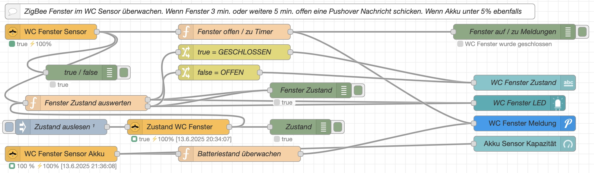

  

  

# ZigBee Window- Doorsensor Monitoring - Node-RED Flow

## Overview
This Node-RED flow is designed to monitor a ZigBee-based Door- Window-Sensor. It detects the window status (open/closed) and monitors the sensor's battery level. Relevant state changes trigger Pushover notifications.

  

  

## Features
Window Status Detection: Identifies whether the window is open longer or closed.  
Battery Status Monitoring: Keeps track of the sensor's battery level.  
Notification System: Sends Pushover notifications if it is open for an adjustable time (so that you don´t forget to close the Window, Door), if it is closed and if the battery level is low.  

## Requirements
My Installation based on an Raspi 4B 8 GB RAM:  
Node-RED with Dashboard installed, Mosquitto installed, ZigBeee2MQTT installed  
(with a [[Sonoff ZigBee 3.0 USB Dongle Plus](https://www.zigbee2mqtt.io/devices/ZBDongle-E.html)] or a [[SLZB-06M Adapter](https://smlight.tech/manual/slzb-06/guide/getting-started/)] via LAN PoE)  
ZigBee sensor compatible with Node-RED (i use this one: [[Aqara MCCGQ11LM](https://www.zigbee2mqtt.io/devices/MCCGQ11LM.html)])  
Pushover Account with credentials to use the notification feature

## Installation
Verify that the above Requirements are met.    
Import the flow into Node-RED.  
Make corrections in the Nodes for your System:  
Configure your ZigBee2MQTT Nodes, enter your Pushover credentials.  
Activate and test the flow.  

## Usage
The flow runs automatically in the background and monitors the sensor.  
A push notification is sent if the window is closed, if it is opened for a adjustable time or the battery is low.

## License
This project is licensed under the MIT License.

## Contact
For questions or improvements, feel free to open an issue on GitHub or submit a pull request.
